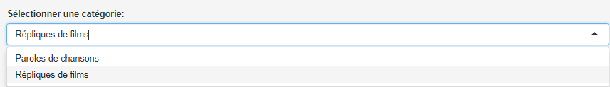
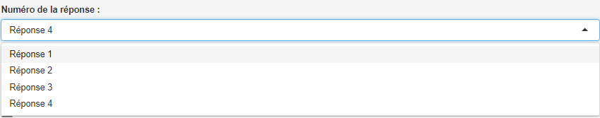
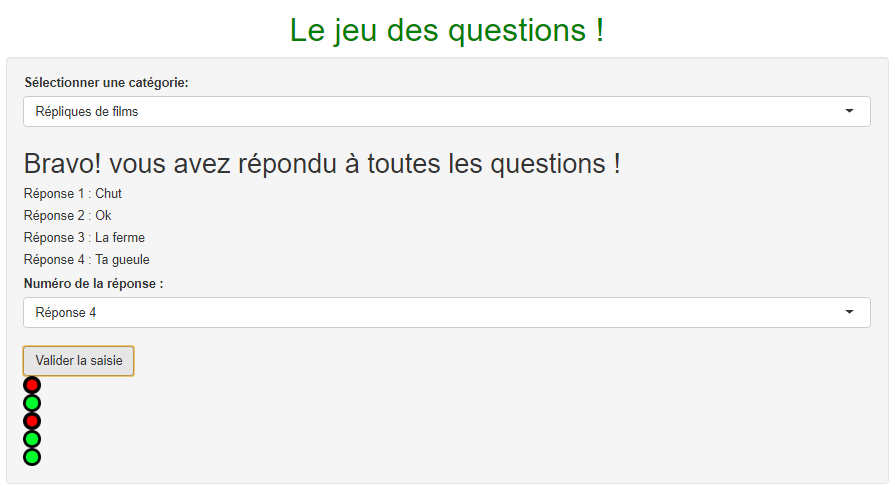

# Principe de l'application

Nous sommes : Louise ARSAC (*Louise-Arsac*), Axel FALIGOT-GIRARDELLI (*Cynism*), Zélie FROMENT (*zeliefroment*), Charlène LAROCHE (*chalarock*), Juliette MAYER (*Ju49*),  Paul SERVAIN (*greenwasher*)  

Notre application **Shiny** s'inspire du jeu télévisé "*N'oubliez pas les paroles !*" et fonctionne sur le principe du jeu de questions.  

Nous vous souhaitons un bon jeu !

------

Les caractéristiques de l'application :

* But du jeu : répondre correctement à 5 questions
* Le joueur peut commencer par choisir la catégorie dans laquelle il veut jouer : Paroles de chansons ou Répliques de films

* Une première question est affichée : le joueur doit saisir le numéro de la réponse qui lui semble être la bonne dans la zone prévue à cet effet

* Une fois que le joueur est certain de sa réponse, il lui faut cliquer sur le bouton "Valider la saisie" :
  * une nouvelle question s'affiche
  * si la réponse est juste :
    * un point vert s'affiche en bas de l'écran
  * si la réponse est fausse :
    * un point rouge s'affiche en bas de l'écran
* Au fil des questions, les points rouges/verts vont s'aligner de manière à ce que le joueur puisse visualiser le résultat général de ses réponses.
* Le jeu s'arrête au bout de 5 questions et affiche le message: Bravo! Vous avez répondu à toutes les questions !

-----

# Comment fonctionne l'application ? 

Pour la rédaction du code, nous avons décidé de nous répartir les tâches par sous-groupes, afin de faciliter le travail à distance.  
Ceci s'est très bien déroulé, et nous nous sommes entraidés mutuellement. 

* Notre appli se base sur des fichiers .csv dans lesquels nous avons rentré, sous forme de tableaux, les questions/réponses ainsi que la valeur VRAI/FAUX de chaque réponse. 
* Lorsque l'application est lancée, 5 lignes du tableau, ce qui correspond à 5 questions, avec leurs réponses, sont sélectionnées au hasard.
* Une variable `input$valeurIndex`, qui correspond au numéro de la ligne de question, va permettre de changer de question. Cette variable vaut 1 au lancement de l'application, puis va augmenter de 1 à chaque fois que le joueur cliquera sur le bouton "valider la saisie" pour passer à la question suivante. 
* Lorsque le joueur clique sur le bouton "Valider la saisie", la valeur saisie par l'utilisateur `input$repUser` est récupérée, qui servira de sélection de la colonne de réponse. Ainsi, les coordonnées de cette réponse seront `tableau[input$valeurIndex,input$repUser]`.  
Cela va permettre au code de récupérer la valeur VRAI/FAUX associée à la réponse choisie. Ainsi, si la valeur est "VRAI", une image représentant un point vert sera affichée au bas de l'écran, si c'est "FAUX", une image représentant un point rouge sera affichée.

-----

# Liste de différentes fonctionnalités & paramètres qui pourraient être améliorés

* Jouer à deux, voire +, sur ce jeu ce qui nécessiterait de créer 2+ interfaces et de bloquer les boutons du joueur qui ne joue pas.
* Bloquer l'accès à l'onglet "Paramètres", pour empêcher le joueur de les modifier, ce qui peut entraîner le disfonctionnement de l'application.
* Associer les scores obtenus aux quizz avec les caractéritsiques des utilisateurs (Prénom,Nom,Age,Sexe) dans le csv qui est généré.
* Avec ces scores enregistrés, faire des statistiques sur :
  * les joueurs et les joueuses:
    * qui donne le plus de bonnes réponses ?
    * les statistiques par âge, pays, sexe
  * les questions
    * quelle réponse est la plus connue / juste le plus souvent ?
    * quelle réponse est la moins connue / fausse le plus souvent ?

* Pouvoir rejouer sans avoir à relancer l'appli (reset global : possible avec history <- 0)

* Avoir un système de points cumulés.
* Ajouter des questions et leurs réponses via une interface dans le programme.

-----

# Autres utilisations possibles de notre application

Nous avons fait le choix de remplir le fichier .csv avec des paroles de chansons pour rendre notre application ludique. Mais on peut compléter ce fichier avec d'autres éléments et ainsi multiplier les solutions d'utilisation de notre application : 

* Paroles de chansons
  * Si vous aimez chanter (comme vu ci-dessus)
* Répliques de films
  * Pour les plus cinéphiles
* Code de la route
  * Pour les autos-écoles
* Questions de culture générale
  * Pour s'amuser en famille pendant le confinement
* Questions de cours
  * Pour les profs adeptes de R-Shiny
* et tout ce qui vous parait bon ! Il suffit juste de changer le nom des csv dans le server.r et les déposer dans le dossier.  
Le code de sélection des csv doit être un peu adapté mais c'est très simple (juste à remplacer les noms des fichiers en haut dans le server.r).

Ainsi on trouverait dans la liste déroulante les différentes catégories cités ci-dessus, comme c'est déjà le cas pour les catégories "Paroles de chansons" et "Répliques de films".

La même application peut présenter un onglet par "jeu". Mais nécessiterait un remaniement du code complet.

-----

# Rédaction du code 

Il a été complètement écris à la main, imaginé par nos soins et avec l'aide de quelques outils sur le web.

* Le but de la première partie a été de créer un code afin d'enregistrer les données des deux utilisateurs, nommées respectivement joueur 1 et joueur 2.  
Ils pourront par la suite jouer au Quizz que nous leurs proposons.  
Nous avons donc défini les deux joueurs avec les caractéristiques suivantes : prénom, nom de famille, âge, nationalité, profession et le sexe de l'utilisateur. Une fois ces données complétées, elles seront affichées directement dans un tableau récapitulatif et pourront être récupérées dans un fichier à part.  
* Le code en lui-même se base sur une vérification des choix de l'utilisateur selon les coordonnées des cellules. Par exemple, si l'utlisateur prend en choix une des 4 valeurs disponibles (numériquement 1,2,3 ou 4), cette valeur numérique sera stockée dans `input$repUser` puis utilisée comme sélection de la colonne : `input$repUser+1` pour sélectionner la colonne avec la réponse associée (la colonne 1 étant celle des questions) et `input$repUser+5` pour sélectionner la colonne avec la valeur de la réponse associée (VRAI ou FAUX).   

Les tableaux sont organisés ainsi :  

* Colonne 1 : `input$valeurIndex` (première liste déroulante du panneau "Paramètres" qui permet de voir le numéro de question. NE PAS CHANGER LA VALEUR)
* Colonne 2 à 4 : `input$repUser+1` (car par ex si on veut la réponse du choix 1, on veut que soit sélectionnée la colonne 2 appelée "RepA" à la ligne `input$valeurIndex`)
* Colonne 5 à 9 : `input$repUser+5` (car par ex si on veut la valeur du choix 1, on veut que soit sélectionnée la colonne 6 appelée "ValeurA" à la ligne `input$valeurIndex`)  

Pourquoi un `valeurIndex` et un `index` ?
Le système obéis à cet ordre:  

* `index` vaut 2 dès le départ : cela correspond à la prochaine valeur que recevra `valeurIndex`, le numéro de la ligne de la question.
* `valeurIndex` vaut 1 dès le départ : cela correspond à l'affichage de la première ligne de question/réponses associées.
* L'utilisateur fait son choix et le valide.
* `valeurIndex` récupère la valeur de `index` grâce à `isolate(input$index)` qui permet de récupérer la valeur de `index` que lorsque l'utilisateur clique sur le bouton de validation de question. Suite à cela,`index` augmente de 1.
* Question suivante pour l'utilisateur.
* etc

